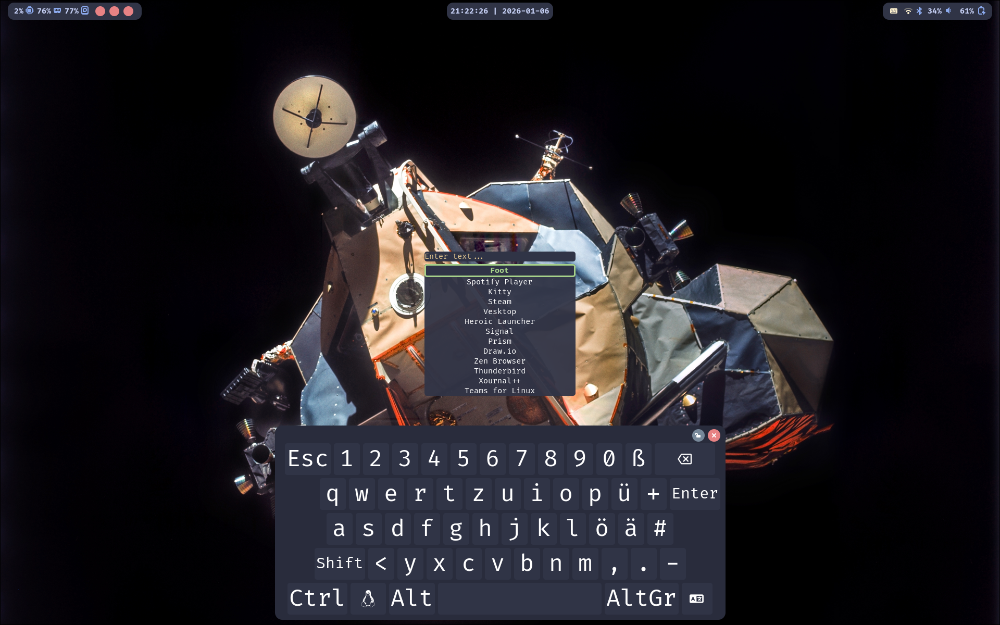
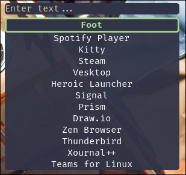
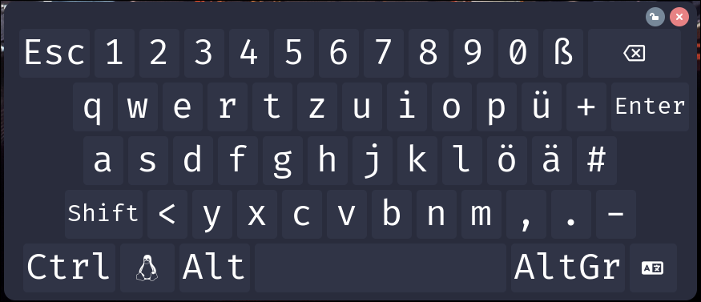

# dod-shell

> My personal shell designed to be integrated with my [NixOs](https://github.com/dod-101/nixOS-dots) config

## ❗ Note ❗

This is designed primarily for my personal use.
Because of this don't expect this to be super-duper configurable or act like a sort of widget framework.
If you are looking for something like that I recommend looking at something like
[ags](https://github.com/Aylur/ags) or [eww](https://github.com/elkowar/eww/pull/1289).

Nonetheless if you are looking to write your own shell / widgets from scratch using rust this repo will be a valuable resource on how to do just that.

## 🏗️ Todo 🏗️

- [ ] Write the actual components
- [ ] Write tests
- [x] Document all of the code

## ✨ Components ✨

Image credit: [Apollo 17, NASA, Image Reprocessing: Andy Saunders](https://apod.nasa.gov/apod/ap251227.html)

Colors: Catppuccin (see my [NixOS config](https://github.com/dod-101/NixOs-dots) for more details) ]

### Launcher

> Let's you launch apps, do simple calculations, search the web & view your clipboard history

### Bar

> Displays useful system information

### Osk (On-screen-keyboard)

> Allows you type using your touchscreen

### Overlay (Soon™)

> Overlay to control different parts of the shell and other parts of your system

### Color Picker (Soon™)

> An actually good color picker

## CLI

<!-- TODO: Add proper auto-generated docs -->

`dod-shell-cli help`

## 🖌️ Styling & Config 🖌️

All files are located in `$HOME/.config/dod-shell`

- Style: `style.scss` (using gtk-css & scss as a pre-processor)

- Main Config: `config.toml`

- Osk layouts: `layouts.json`

> [!TIP]
>
> Run `dod-shell-cli generate-config` to get a good place to start from including a json schema for `layouts.json`

## License

This project is licensed under either of

- [Apache License, Version 2.0](https://www.apache.org/licenses/LICENSE-2.0)
- [MIT License](https://opensource.org/license/MIT)

at your option.
